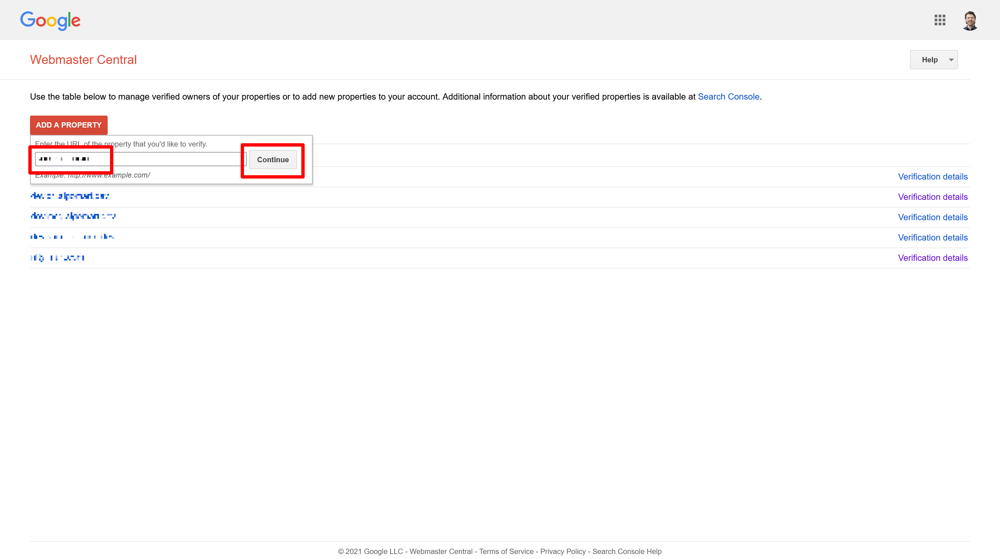
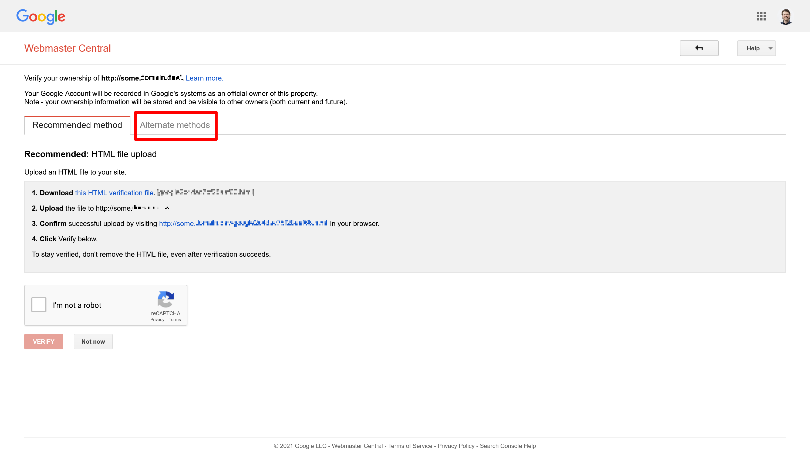
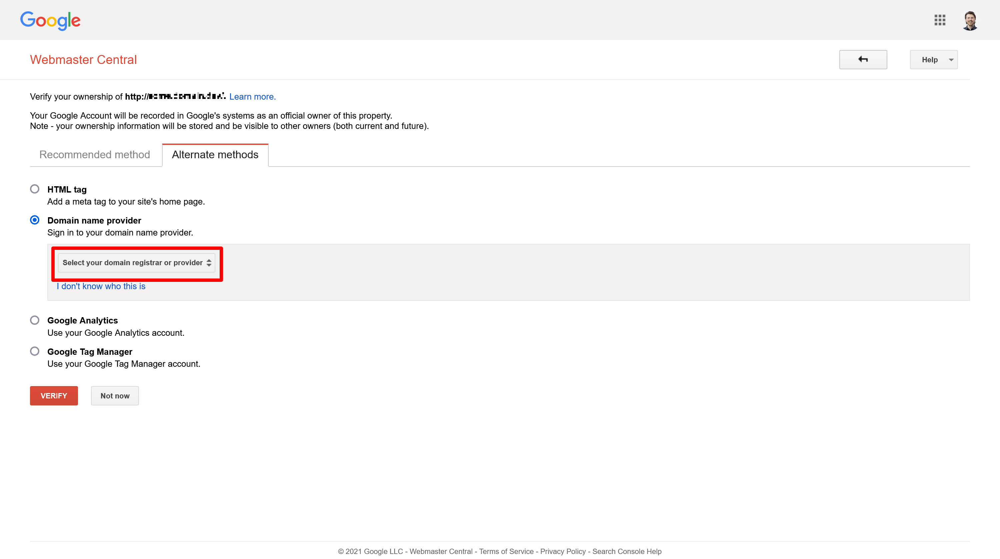
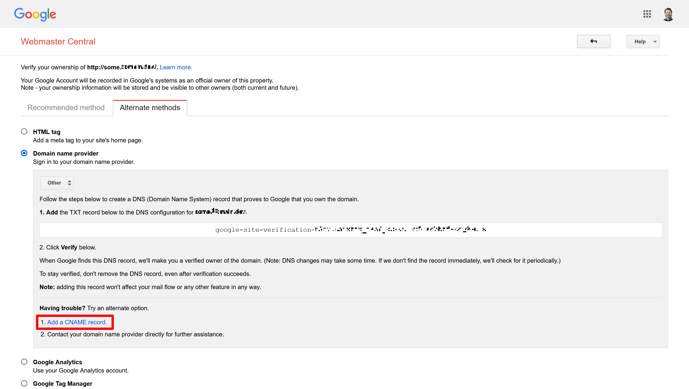
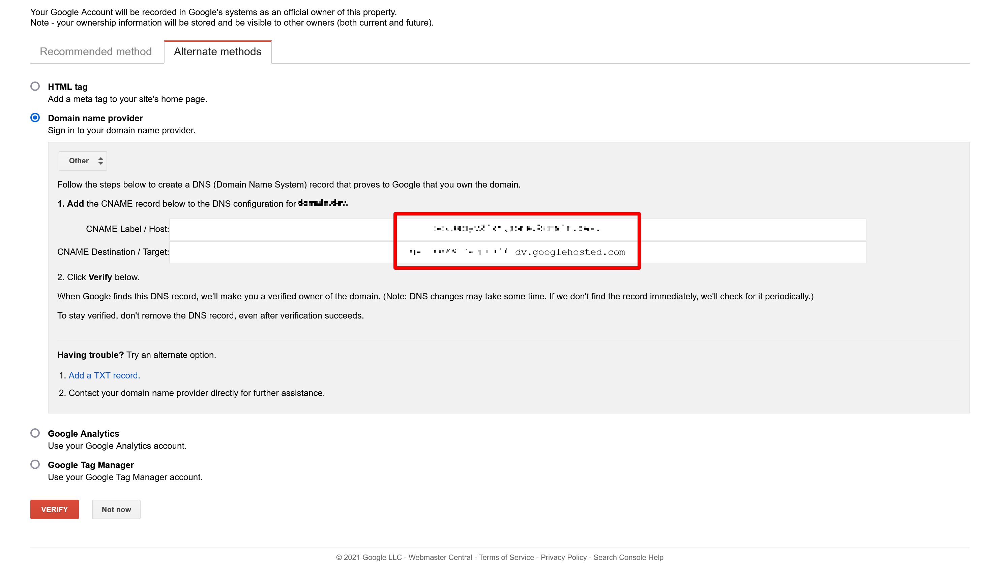
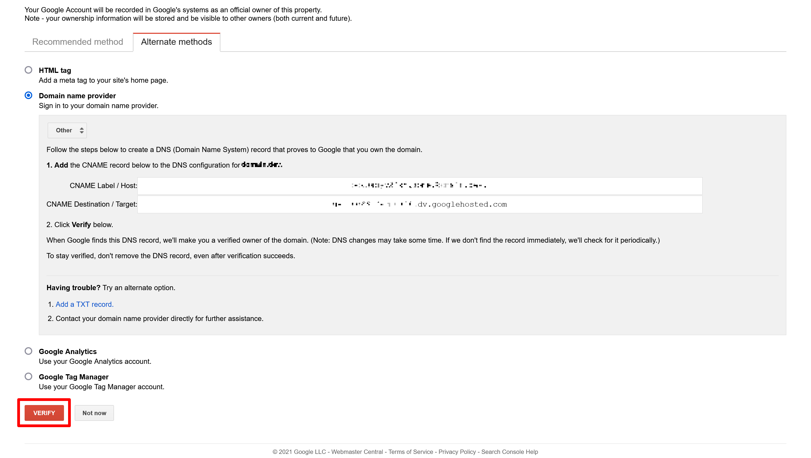
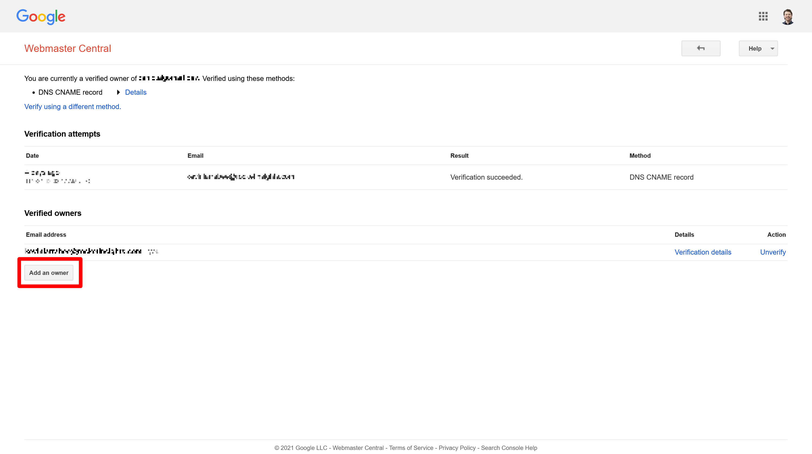
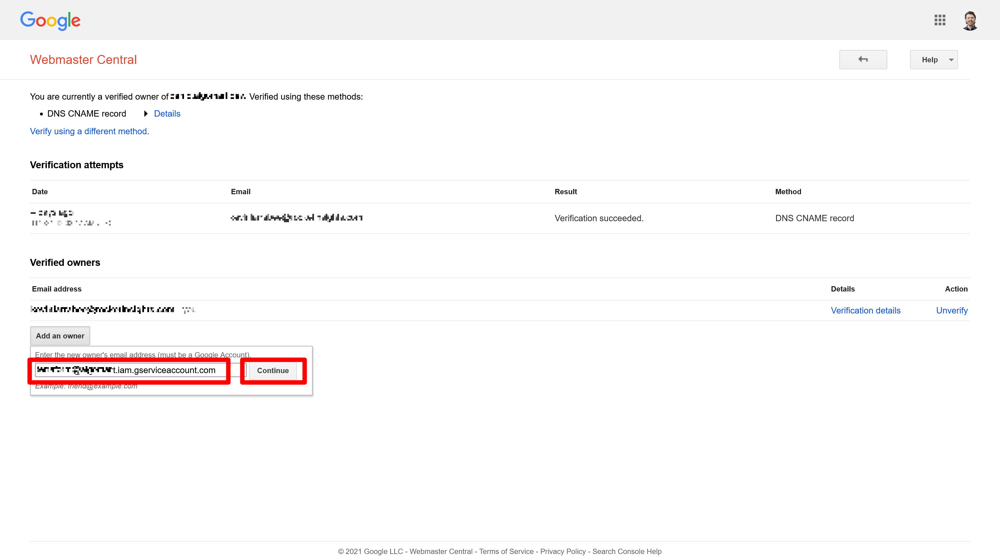

# Registering domains for domain-mapping

Cloud Run domain-mapping (a beta service
[not available](https://cloud.google.com/run/docs/mapping-custom-domains#limitations)
in many regions)
offers a convenient alternative to
[setting up load balancers](https://cloud.google.com/load-balancing/docs/https/setting-up-https-serverless)
and SSL certs manually, which will not be covered here.

With just a few steps, we can assign custom domains to our Cloud Run
services.

We essentially just need to register the service account that Terraform
will use as a **verified owner** of the domain in Google Webmaster,
set up the relevant DNS records for each subdomain we want,
and then let Terraform and Cloud Run do the rest.

For this walkthrough, we will assume that we want our services mapped
to the following domains, with the front-end hosted on the highest subdomain.

| Service |             Host name |
| ------- | --------------------: |
| API     | `api.dev.example.com` |
| CMS     | `cms.dev.example.com` |
| Web     |     `dev.example.com` |

This setup involves created 4 CNAME records; one for each service, and
another to act as the verification for Google.
If the API and/or CMS are intended to be hosted on different domains
than the front-end, then all of the highest (sub)domains will need their
own verification records.

## Table of Contents

- [Add domain to Webmaster properties](#add-domain-as-a-property)
- [Create DNS records](#create-dns-records)
- [Verify ownership](#verify-ownership)
- [Registering service account as an owner](#add-service-account-as-an-owner)

## Add domain as a property

Once you are signed into Google, visit the
[Google Webmaster](https://www.google.com/webmasters/verification/home)
page and click "Add a property".

> 

Now fill in the highest-level subdomain that we need to verify ownership for
(again, with the example subdomains above, that would be dev.example.com)
and then click "Continue".

> 

From here, select "Alternate methods" and then "Domain name provider".

> 

In the highlighted dropdown, select either your chosen registrar or "Other"
(setup will likely be the same in either case).

> 

We do not want to use the TXT record method, since this precludes us
from also setting up any CNAME records.
Instead, we want to select "Add a CNAME record".

> 

This gives us a "CNAME host" and a "CNAME target" for use in
creating a CNAME record in the next step.

**Important: Do not click "Verify"**

> 

## Create DNS Records

In a **new tab**, visit your DNS provider and add a CNAME record matching
the above host and target.

Additionally, add 3 other CNAME records - one for each subdomain -
with each pointing to ghs.googlehosted.com.

They should look something like...

> 

Take note of the TTL - we will want to wait until the
DNS records are likely to have been propagated before
proceeding.

## Verify ownership

Once we are sure that the DNS records are set,
we want to go back to the other tab and click "Verify".

> 

If all goes according to plan, you should see a success message.
Click through to view the new property.

## Add service account as an owner

At this point, you should see that your Google account is registered
as a verified user.

Now, we need to click "Add an owner".

> 

In the dialog box, paste in the service account email obtained
when [creating a service account](../configure-gcp/README.md#create-a-service-account) and select "Continue".

> 

You should now see that the Terraform service account is also
registered as a verified owner, which gives it the necessary
permissions to assign domain mappings.

> 
